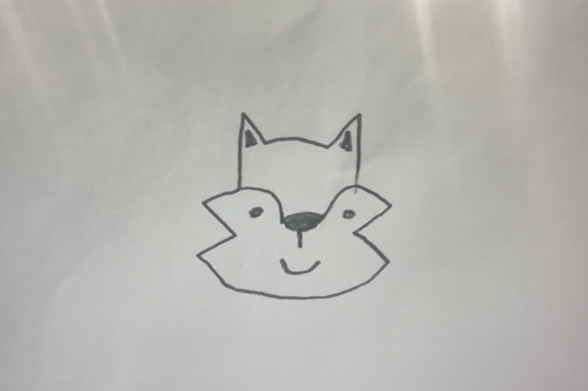

# Project Proposal

1. Roughly, what will your drawing look like
a cartoon-ish fox face

2. What are two variables you could use so that when you change each variable, the drawing changes?
the length of the cheek area, ears, or head top

3. Where is there repetition in your drawing?
in the outline of the cheek area, the bottom and top of the face, 

4. What are the main parts of your drawing? Are there clear sections or objects?
the outside of the face, the inside, 

5. How could you use a loop variable of a for loop? Is there somewhere in your drawing where something is repeated, but it's slightly different each time? Maybe the same object is repeated in different places, or maybe a similar object is repeated but with different sizes?
the inside of the ears are the same with a different size
the top and bottom of the head are the same but flipped

